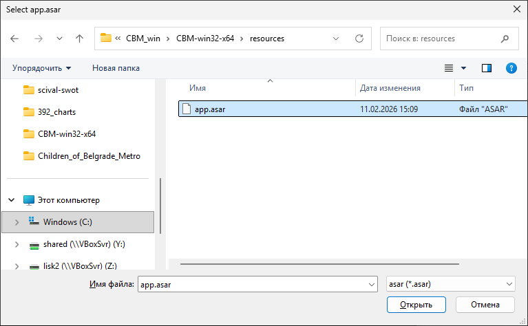
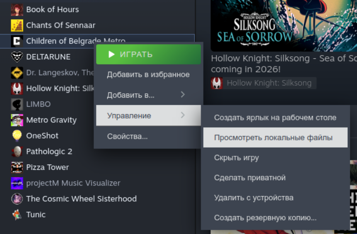

# Русификатор Children of Belgrade Metro

Пока что машинный перевод через Google Translate.

## Установка

Разархивируйте [русификатор](https://github.com/snorkysnark/Children_of_Belgrade_Metro_RU/releases) и запустите `asar_patch.exe`.

В открывшемся диалоге нужно указать расположение файла с ресурсами игры:  
`<папка с игрой>\CBM_win\CBM-win32-x64\resources\app.asar`  



<details>
<summary>Либо можно указать путь в командной строке:</summary>

```
asar_patch.exe C:\Program Files (x86)\Steam\steamapps\common\Children_of_Belgrade_Metro\CBM_win\CBM-win32-x64\resources\app.asar
```

</details>

---

Где установлена игра можно посмотреть в библиотеке Steam:



